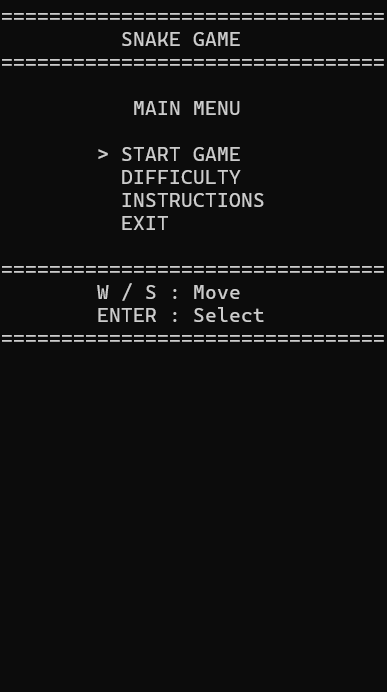
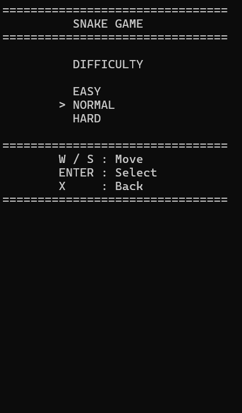
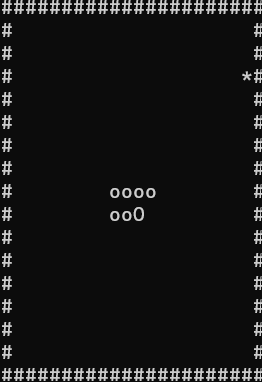
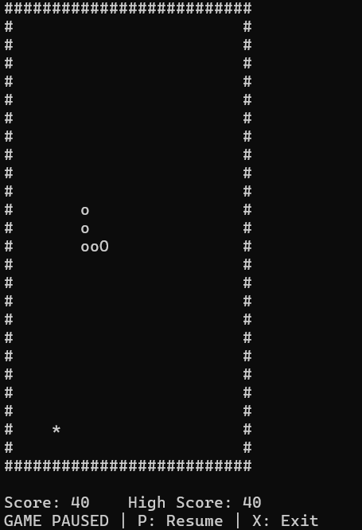
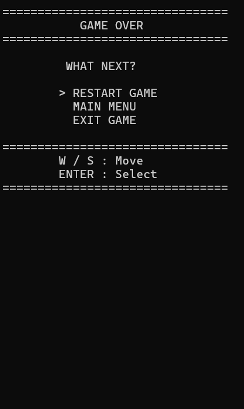
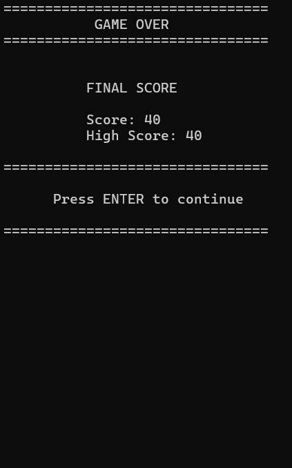

# Snake Game

A classic Snake Game built with **C++** for the **Windows Console**.

This project was created as a C++ programming practice project, focusing on **Object-Oriented Programming, game loops, finite state machines, collision detection, console rendering, keyboard input, and file persistence**.

---

## Overview

Snake Game is a console-based implementation of the classic Snake game.

The player controls the snake using the keyboard, eats fruits to increase the score, avoids the walls and its own body, and tries to achieve the highest possible score.

The project also includes a menu system, difficulty settings, pause/resume functionality, a game-over screen, and persistent high scores.

---

## Features

* Main Menu
* Start Game
* Difficulty Selection

  * Easy
  * Normal
  * Hard
* Instructions Menu
* WASD keyboard controls
* Pause / Resume
* Score system
* Persistent High Score
* Collision detection

  * Wall collision
  * Self collision
* Game Over Screen
* Restart Game
* Return to Main Menu
* Exit Game
* Partial console rendering to reduce unnecessary screen flickering

---

## Gameplay

The objective is simple:

1. Control the snake using **WASD**.
2. Eat the fruit (`*`) to increase your score.
3. Each fruit gives **10 points**.
4. Avoid hitting the walls.
5. Avoid hitting the snake's own body.
6. Try to achieve a new high score.

The snake becomes longer after eating fruit, making the game progressively more difficult.

---

## Controls

| Key     | Action           |
| ------- | ---------------- |
| `W`     | Move Up          |
| `A`     | Move Left        |
| `S`     | Move Down        |
| `D`     | Move Right       |
| `P`     | Pause / Resume   |
| `X`     | Exit             |
| `ENTER` | Select / Confirm |
| `W / S` | Navigate menus   |

### Menu Controls

```text
W / S     Move selection
ENTER     Select
X         Go back
```

---

## Difficulty

The game provides three difficulty levels.

| Difficulty | Game Speed | Description     |
| ---------- | ---------: | --------------- |
| Easy       |     124 ms | Slower movement |
| Normal     |      64 ms | Balanced speed  |
| Hard       |      24 ms | Faster movement |

The game speed is controlled using the delay between game-loop updates.

---

## Game States

The game uses a **Finite State Machine (FSM)** to manage its different states.

```text
MENU
  |
  +--> DIFFICULTY_MENU
  |
  +--> INSTRUCTIONS_MENU
  |
  +--> PLAYING
          |
          +--> PAUSED
          |      |
          |      +--> PLAYING
          |
          +--> GAME_OVER_SCREEN
                    |
                    v
                GAME_OVER
                  |
                  +--> RESTART_GAME
                  |
                  +--> MAIN_MENU
                  |
                  +--> EXIT_GAME

Any state can eventually lead to EXITED.
```

### Available States

```cpp
enum GameState {
    MENU,
    DIFFICULTY_MENU,
    INSTRUCTIONS_MENU,
    PLAYING,
    PAUSED,
    GAME_OVER_SCREEN,
    GAME_OVER,
    EXITED
};
```

Using separate states makes the game flow easier to understand and maintain.

---

## Game Architecture

The project is divided into several responsibilities.

### `main.cpp`

Responsible for the main game loop and state dispatching.

The main loop follows this general structure:

```text
Input
  ↓
Logic
  ↓
Draw
  ↓
Sleep
  ↓
Repeat
```

Different states are handled separately:

```text
MENU
    → Menu input

PLAYING
    → Input
    → Logic
    → Draw

PAUSED
    → Input

GAME_OVER_SCREEN
    → Game Over screen input

GAME_OVER
    → Game Over menu input
```

---

### `SnakeGame.h`

Contains the game's main declarations:

* `Point` structure
* Direction enum
* Game state enum
* Menu options
* Game-over options
* Difficulty enum
* `SnakeGame` class
* Public and private member functions

---

### `SnakeGame.cpp`

Contains the main implementation:

* Game initialization
* Keyboard input
* Snake movement
* Fruit spawning
* Collision detection
* Score handling
* High score persistence
* Menu handling
* Game state transitions
* Console rendering

---

## Rendering

The game uses Windows console cursor positioning instead of repeatedly clearing the entire console every frame.

The project uses two rendering approaches.

### Full Rendering

Used when the entire screen needs to be redrawn, such as:

* Starting a new game
* Pausing
* Resuming
* Switching screens
* Restarting

```cpp
DrawFullBoard();
```

### Partial Rendering

During normal gameplay, only changed parts of the board are updated.

```cpp
DrawUpdatedBoard();
```

The game keeps track of information such as:

```cpp
Point previousHead;
Point previousTail;
bool ateFruit;
bool needFullDraw;
```

This reduces unnecessary console redraws and helps minimize visual flickering.

---

## Collision Detection

The game checks two main types of collision.

### Wall Collision

The board size is:

```text
24 × 24
```

The snake loses when its head moves outside the playable area.

```cpp
if (head.x < 0 || head.x >= width ||
    head.y < 0 || head.y >= height)
```

### Self Collision

The snake also loses when its head reaches a position occupied by its body.

```cpp
for (const auto& t : tail) {
    if (head.x == t.x && head.y == t.y) {
        // Game Over
    }
}
```

---

## Score System

Every fruit gives:

```text
+10 points
```

When the current score exceeds the stored high score, the high score is updated.

```text
Score
  ↓
Compare with High Score
  ↓
New High Score?
  ↓
Save to file
```

---

## High Score Persistence

The high score is stored in:

```text
data/highscore.txt
```

When the game starts:

```text
LoadHighScore()
```

loads the previous high score.

When a new high score is achieved:

```text
SaveHighScore()
```

writes the new value to the file.

This means the high score remains available even after closing and reopening the game.

---

## Project Structure

```text
SnakeGame/
│
├── include/
│   └── SnakeGame.h
│
├── src/
│   ├── main.cpp
│   └── SnakeGame.cpp
│
├── data/
│   └── highscore.txt
│
├── docs/
│   └── screenshots/
│
├── .gitignore
├── README.md
└── SnakeGame.exe
```

> `SnakeGame.exe` is a generated build output and may be excluded from Git depending on the `.gitignore` configuration.

---

## Technologies

* **C++**
* **Object-Oriented Programming**
* **Finite State Machine**
* **Windows Console API**
* **`<conio.h>`** for keyboard input
* **`<windows.h>`** for console control and timing
* **File I/O** using `<fstream>`
* **Git / GitHub**

---

## Requirements

To build and run this project, you need:

* Windows
* A C++ compiler such as **MinGW / g++**
* A Windows console terminal

The project uses Windows-specific libraries such as:

```cpp
#include <windows.h>
#include <conio.h>
```

Therefore, it is currently designed for **Windows**.

---

## Build

Clone the repository and open a terminal in the project directory.

### 1. Enter the project directory

```bash
cd SnakeGame
```

### 2. Compile

Using `g++`:

```bash
g++ src\main.cpp src\SnakeGame.cpp -o SnakeGame.exe
```

### 3. Run

```bash
SnakeGame.exe
```

---

## Running from the Project Directory

Make sure the program is executed from the project root:

```text
SnakeGame/
```

This is important because the game loads the high score using:

```text
data/highscore.txt
```

The expected structure is:

```text
SnakeGame/
├── SnakeGame.exe
├── data/
│   └── highscore.txt
├── include/
└── src/
```

---

## Screenshots

### Main Menu



### Difficulty Menu



### Gameplay



### Pause



### Game Over



### High Score



> If a screenshot has not been added yet, remove its image entry until the corresponding file is available.

---

## What I Learned

This project was developed as a practical C++ learning project.

Through the project, I practiced:

* Designing classes in C++
* Encapsulation
* Structures and enumerations
* `std::vector`
* Functions and member functions
* Game loops
* Finite State Machines
* Keyboard input handling
* Collision detection
* Random number generation
* File input/output
* Persistent data
* Console cursor manipulation
* Rendering optimization
* Debugging and refactoring
* Git and GitHub workflow

One of the main goals of the project was to understand how individual programming concepts can be combined into a complete interactive application.

---

## Design Highlights

### Finite State Machine

Instead of controlling the entire game with many unrelated boolean variables, the project uses a `GameState` enum.

For example:

```cpp
state = PLAYING;
```

or:

```cpp
state = PAUSED;
```

This makes transitions between different parts of the game explicit.

---

### Separation of Responsibilities

The project separates major responsibilities into different functions.

For example:

```cpp
Input();
Logic();
Draw();
```

This follows a simple game-programming structure:

```text
Input
  ↓
Game Logic
  ↓
Rendering
```

This structure also makes debugging easier because input, gameplay logic, and rendering can be inspected separately.

---

### Rendering Optimization

A full console clear is relatively expensive visually because it can cause flickering.

Instead, normal gameplay uses partial updates:

```cpp
DrawUpdatedBoard();
```

Only when necessary does the game perform:

```cpp
DrawFullBoard();
```

This was implemented to improve the visual stability of the console game.

---

## Future Improvements

Possible improvements for future versions include:

* Sound effects
* More visual effects
* Additional difficulty levels
* Configurable game speed
* Better console UI
* Improved fruit and snake graphics
* Leaderboard system
* Multiple fruit types
* Special items
* More game modes
* Cross-platform support
* More advanced rendering

These features are intentionally outside the current scope of the project.

---

## Current Project Status

The current version includes the core gameplay loop and supporting systems:

```text
[✓] Snake movement
[✓] Fruit spawning
[✓] Score system
[✓] High score persistence
[✓] Collision detection
[✓] Main menu
[✓] Difficulty system
[✓] Instructions
[✓] Pause / Resume
[✓] Game Over screen
[✓] Restart
[✓] Main Menu navigation
[✓] Exit
[✓] Partial rendering
[✓] GitHub project structure
```

---

## Author

**Phan Quoc Huy**
GitHub : 'huypq020607-code'

Information Technology Student
Interested in **Game AI Programming**

This Snake Game is one of my C++ practice projects and serves as a foundation for learning more advanced game programming concepts.

---

## License

This project is intended primarily for learning and educational purposes.

You are welcome to explore the source code and use the ideas in your own learning projects.
